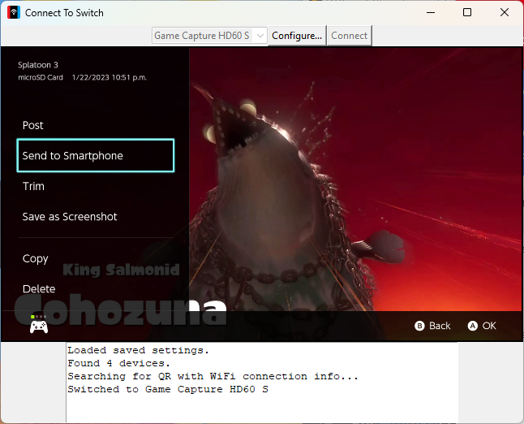
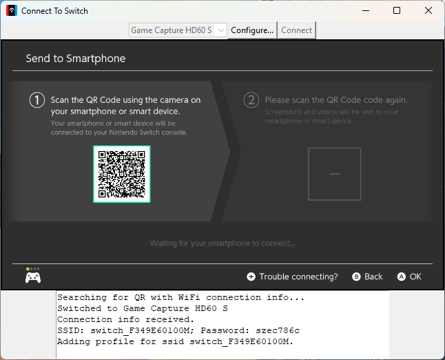
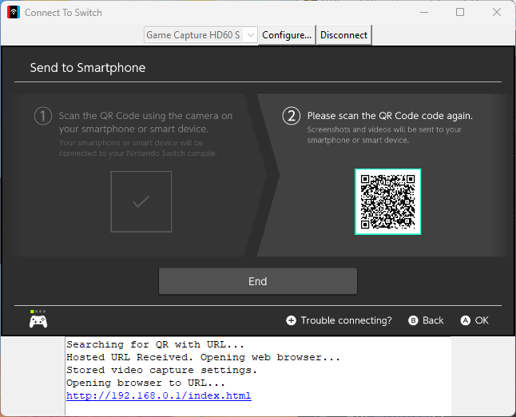
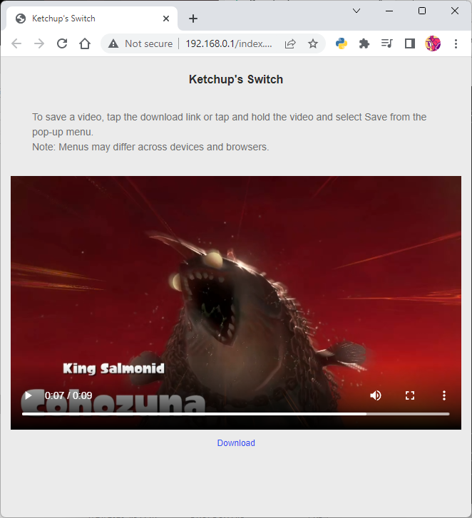

# SwitchSendToPC

Python 3 Application for automatically connecting a PC to the temporary hotspot created by the Nintendo Switch to serve media to a smartphone



<p>


</p>



## How To Use

### Interface

The SwitchSendToPC application opens GUI Window which allows you to select a capture device and connect to your Nintendo Switch's WiFi hot spot. This window has a few buttons at the top, include a text entry or dropdown, depending on your platform. It also displays video from the currently configured capture device, or a black screen if no device is currently active.

### Usage

When you initially launch the application, you will need to select the capture device your Nintendo Switch is using before attempting a connection. At the end of the process, the application will open browser window with the album web page serviced by your Nintendo Switch. At this time, the application will save the video capture device used. The next time you launch it, it will load your settings and immediately attempt to connect to the Switch.

### How to Set Up the hotspot transfer from the Nintendo Switch:

1. From the HOME Menu select Album, then select a screenshot or video capture.
2. Select Sharing and Editing, then select Send to Smartphone.
3. Select "Only This One" or "Send a Batch"
4. A screen with a QR code will appear with the encoded SSID and password.

Media served by Switch will likely be at: http://192.168.0.1/index.html

## Requirements

- Requires Python 3.6+
- Requires opencv-python
- Your PC must have a WiFi Adapter
- Linux requires nmcli and must be run with root privileges
- videoinput.dll (included, 64-bit) is used to match names to capture devices on Windows (https://github.com/hasegaw/videoInput)

## Compilation

```sh
pyinstaller -F --add-binary="win/videoinput.dll;." --add-data="icon.ico;." --windowed --icon icon.ico ./switch_send_to_pc.py
```

